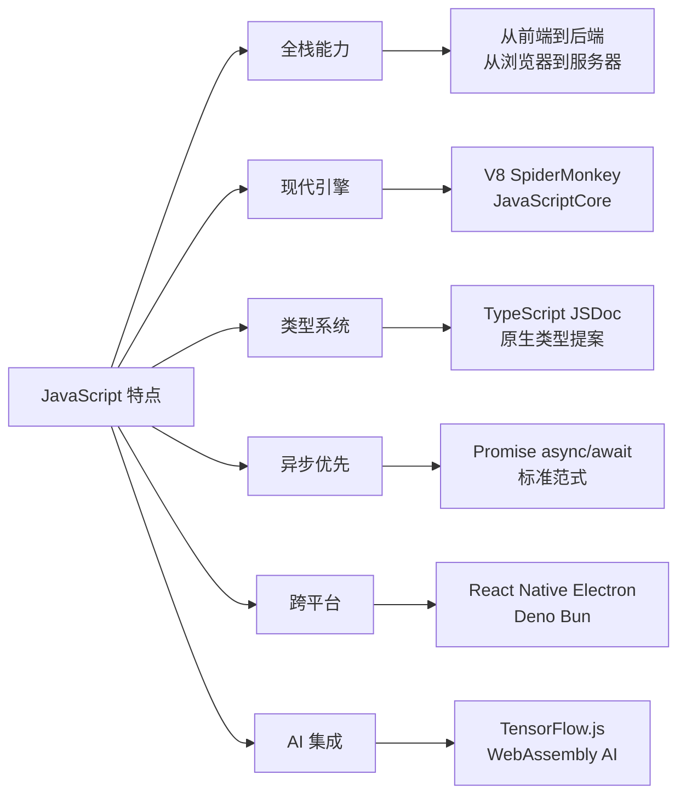
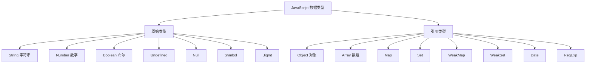
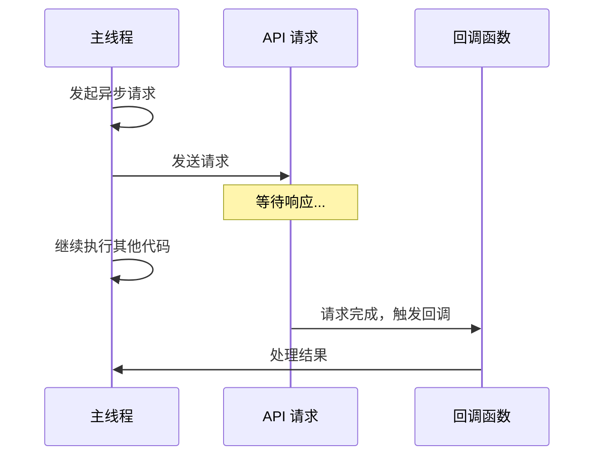
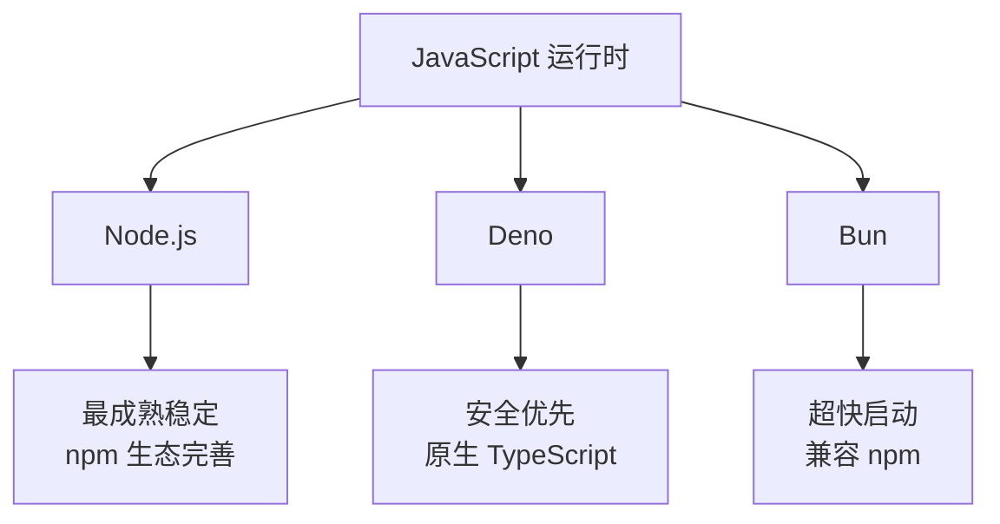
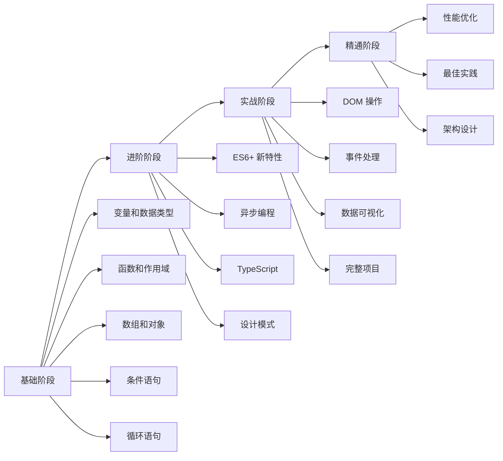

# 2026 年 JavaScript 完全指南：从入门到精通的全栈开发之路

> 这是一份面向 2026 年的 JavaScript 学习指南，涵盖从基础语法到最新 ES2026 特性的完整知识体系。无论你是编程新手还是后端开发者，都能在这里找到适合你的学习路径。

---

## 目录

1. [JavaScript 的进化：从脚本语言到全栈核心](#1-javascript-的进化从脚本语言到全栈核心)
2. [基础篇：掌握编程的基石](#2-基础篇掌握编程的基石)
3. [进阶篇：现代 JavaScript 开发范式](#3-进阶篇现代-javascript-开发范式)
4. [实战篇：5 个完整项目案例](#4-实战篇 5 个完整项目案例)
5. [生态篇：2026 年的 JS 工具链](#5-生态篇 2026 年的-js 工具链)
6. [学习路线图](#6-学习路线图)

---

## 1. JavaScript 的进化：从脚本语言到全栈核心

### 1.1 什么是 JavaScript？

JavaScript 是世界上最流行的编程语言之一。截至 2026 年，JavaScript 已经从单纯的浏览器脚本语言发展成为**全栈开发的核心技术**，被广泛应用于前端、后端、移动应用、桌面应用和边缘计算等领域。

Web 开发的三大基石：

```
┌─────────────────────────────────────────┐
│              Web 页面                    │
├─────────────────────────────────────────┤
│  HTML  →  定义网页的结构 (骨架)          │
│  CSS   →  定义网页的样式 (皮肤)          │
│  JS    →  定义网页的行为和交互逻辑 (灵魂)│
└─────────────────────────────────────────┘
```

### 1.2 JavaScript 的六大特点（2026 视角）



### 1.3 JavaScript 能做什么？

| 领域 | 技术栈 | 应用场景 |
|------|--------|----------|
| 🌐 Web 前端 | React、Vue、Svelte | 构建复杂单页应用 |
| 🚀 后端开发 | Node.js、Bun、Deno | 高性能服务器 API |
| 📱 移动应用 | React Native、Capacitor | 跨平台移动 App |
| 💻 桌面应用 | Electron、Tauri | 跨平台桌面软件 |
| 🤖 AI/ML | TensorFlow.js、WebAI | 浏览器中运行 AI 模型 |
| 🔧 自动化工具 | npm 脚本、Vite、ESLint | 开发生态工具链 |
| 🎮 游戏开发 | Three.js、Babylon.js | 3D 游戏和可视化 |
| 📊 数据可视化 | Chart.js、ECharts、D3 | 交互式图表和仪表板 |

### 1.4 第一个 JavaScript 程序（现代写法）

```javascript
// 传统方式（仍然可用）
alert('Hello, JavaScript!');

// 推荐方式（更现代）
const showMessage = (message) => {
    console.log(message);
    document.body.insertAdjacentHTML('beforeend', `<p>${message}</p>`);
};

showMessage('Hello, Modern JavaScript!');
```

### 1.5 在 HTML 中使用 JavaScript 的最佳实践

```html
<!-- 1. 模块化脚本（推荐）-->
<script type="module" src="./app.js"></script>

<!-- 2. 延迟加载（性能优化）-->
<script src="main.js" defer></script>

<!-- 3. 事件监听器（推荐）-->
<button data-action="greet">点击我</button>
<script type="module">
    document.querySelector('[data-action="greet"]')
        .addEventListener('click', () => {
            alert('点击了!');
        });
</script>
```

---

## 2. 基础篇：掌握编程的基石

### 2.1 变量和数据类型

#### 2.1.1 声明变量的现代最佳实践

```javascript
// ✅ const（首选，不可变引用）
const API_URL = "https://api.example.com";
const config = { timeout: 5000 };
config.timeout = 3000; // ✅ 允许修改对象内容
// config = {}; // ❌ 报错：Assignment to constant variable

// ✅ let（用于需要重新赋值的变量）
let counter = 0;
counter = counter + 1; // ✅ 允许

// ⚠️ var（已过时，不推荐）
// 仅在维护旧代码时使用
var name = "张三";
```

**最佳实践原则：**
- 优先使用 `const` - 默认选择，防止意外修改
- 需要重新赋值时使用 `let` - 明确表示值会改变
- 避免使用 `var` - 函数作用域容易导致 bug
- 使用解构赋值提取值 - 代码更简洁

#### 2.1.2 数据类型全景图



```javascript
// 原始类型
const name = "Hello";                    // 字符串
const age = 25;                          // 数字
const price = 19.99;                     // 浮点数
const bigNumber = 9007199254740991n;     // BigInt
const isActive = true;                   // 布尔
const sym = Symbol('description');       // Symbol
let x;                                   // undefined
const y = null;                          // null

// 引用类型
const person = {                         // 对象
    name: "张三",
    age: 25,
    greet() {
        return `Hello, I'm ${this.name}`;
    }
};

const colors = ["红色", "绿色", "蓝色"];   // 数组
const map = new Map();                   // Map
map.set('key', 'value');
const unique = new Set([1, 2, 2, 3]);    // Set → [1, 2, 3]
```

#### 2.1.3 现代特性：解构和展开

```javascript
// 数组解构
const [first, second, ...rest] = [1, 2, 3, 4, 5];
// first = 1, second = 2, rest = [3, 4, 5]

// 对象解构
const { name, age, city = "上海" } = person;
// name = "张三", age = 25, city = "北京"（默认值）

// 展开运算符
const newArray = [...colors, "紫色"];           // 合并数组
const newPerson = { ...person, email: "test@example.com" }; // 合并对象
```

#### 2.1.4 可选链（?.）和空值合并（??）

```javascript
// 可选链 - 安全访问嵌套属性
const user = { profile: { name: "张三" } };
const name = user?.profile?.name;    // "张三"
const age = user?.profile?.age;      // undefined（不会报错）

// 空值合并 - 仅当值为 null 或 undefined 时使用默认值
const userName = user?.name ?? "匿名用户";  // "匿名用户"
const displayName = "" ?? "默认值";         // ""（空字符串不是 null/undefined）

// 可选链赋值（ES2021）
user?.profile?.email = "test@example.com";
```

### 2.2 函数：代码的基石

#### 2.2.1 函数声明的三种方式

```javascript
// 1. 函数声明（传统方式）
function greet(name) {
    return "你好，" + name + "!";
}

// 2. 函数表达式
const greet = function(name) {
    return "你好，" + name + "!";
};

// 3. 箭头函数（ES6，推荐）
const greet = (name) => {
    return "你好，" + name + "!";
};

// 简写形式（单表达式）
const greetSimple = name => "你好，" + name + "!";
```

#### 2.2.2 函数参数的现代用法

```javascript
// 默认参数
function greet(name = "朋友") {
    return "你好，" + name + "!";
}
greet();           // "你好，朋友!"
greet("小明");     // "你好，小明!"

// 剩余参数
function sum(...numbers) {
    return numbers.reduce((total, num) => total + num, 0);
}
sum(1, 2, 3, 4, 5);  // 15

// 解构参数
function createUser({ name, age, city }) {
    return `用户 ${name}, ${age}岁，来自${city}`;
}
const user = { name: "张三", age: 25, city: "北京" };
createUser(user);  // "用户 张三，25 岁，来自北京"
```

#### 2.2.3 作用域详解

```javascript
// 全局变量
let globalVar = "我是全局变量";

function testScope() {
    // 局部变量（块级作用域）
    let localVar = "我是局部变量";
    const constantVar = "我是常量";
    
    console.log(globalVar);  // ✅ 可以访问
    console.log(localVar);   // ✅ 可以访问
}

console.log(globalVar);  // ✅ 可以访问
console.log(localVar);   // ❌ 错误：无法访问
```

### 2.3 数组和对象：数据结构的核心

#### 2.3.1 数组操作大全

```javascript
// 创建数组
let fruits = ["苹果", "香蕉", "橙子"];
let numbers = [1, 2, 3, 4, 5];

// 添加/删除元素
fruits.push("葡萄");      // 在末尾添加
fruits.unshift("草莓");   // 在开头添加
fruits.pop();             // 删除末尾元素
fruits.shift();           // 删除开头元素

// 常用数组方法
const arr = [1, 2, 3, 4, 5];

arr.map(x => x * 2);           // [2, 4, 6, 8, 10] - 映射
arr.filter(x => x > 2);        // [3, 4, 5] - 过滤
arr.reduce((sum, x) => sum + x, 0);  // 15 - 归约
arr.find(x => x > 3);          // 4 - 查找
arr.some(x => x > 3);          // true - 是否存在
arr.every(x => x > 0);         // true - 是否全部满足
arr.sort((a, b) => a - b);     // 排序
arr.reverse();                 // 反转

// 遍历数组
fruits.forEach((item, index) => {
    console.log(`${index}: ${item}`);
});
```

#### 2.3.2 对象操作详解

```javascript
// 创建对象
let person = {
    name: "张三",
    age: 25,
    city: "北京"
};

// 访问属性
console.log(person.name);      // 点表示法："张三"
console.log(person["age"]);    // 方括号表示法：25

// 修改和添加属性
person.age = 26;
person.city = "上海";
person.email = "test@example.com";

// 删除属性
delete person.email;

// 对象方法
let personWithMethod = {
    name: "张三",
    greet: function() {
        return "你好，我是" + this.name;
    },
    // 简写形式
    celebrateBirthday() {
        this.age++;
        return this.age;
    }
};
```

### 2.4 条件语句：控制程序流程

#### 2.4.1 if-else 语句

```javascript
let score = 75;

if (score >= 90) {
    console.log("优秀!");
} else if (score >= 80) {
    console.log("良好!");
} else if (score >= 60) {
    console.log("及格!");
} else {
    console.log("没及格!");
}
```

#### 2.4.2 三元运算符

```javascript
// 传统写法
let age = 18;
let message;
if (age >= 18) {
    message = "成年人";
} else {
    message = "未成年人";
}

// 三元运算符写法（简洁）
let message2 = age >= 18 ? "成年人" : "未成年人";
```

#### 2.4.3 switch 语句

```javascript
let day = 3;
let dayName;

switch (day) {
    case 1:
        dayName = "星期一";
        break;
    case 2:
        dayName = "星期二";
        break;
    case 3:
        dayName = "星期三";
        break;
    default:
        dayName = "未知";
}
```

#### 2.4.4 比较运算符和逻辑运算符

```javascript
// 比较运算符
let x = 5;
let y = "5";

console.log(x == y);    // true（值相等，不检查类型）
console.log(x === y);   // false（严格相等，类型也要相同）✅ 推荐
console.log(x != y);    // false
console.log(x !== y);   // true ✅ 推荐

// 逻辑运算符
let age = 25;
let hasLicense = true;

if (age >= 18 && hasLicense) {   // 与：所有条件都为 true
    console.log("可以开车!");
}

let isWeekend = true;
let isHoliday = false;

if (isWeekend || isHoliday) {    // 或：任意一个条件为 true
    console.log("可以休息!");
}

let isRaining = false;
if (!isRaining) {                // 非：反转布尔值
    console.log("可以出门!");
}
```

### 2.5 循环语句：重复执行的艺术

#### 2.5.1 for 循环

```javascript
// 基本 for 循环
for (let i = 0; i < 5; i++) {
    console.log("数字：" + i);
}
// 输出：0, 1, 2, 3, 4

// for...of（遍历可迭代对象，推荐）
let fruits = ["苹果", "香蕉", "橙子"];
for (let fruit of fruits) {
    console.log("水果：" + fruit);
}

// for...in（遍历对象属性）
let person = { name: "张三", age: 25, city: "北京" };
for (let key in person) {
    console.log(`${key}: ${person[key]}`);
}
```

#### 2.5.2 while 和 do-while 循环

```javascript
// while 循环
let i = 0;
while (i < 5) {
    console.log("数字：" + i);
    i++;
}

// do-while 循环（至少执行一次）
let j = 0;
do {
    console.log("数字：" + j);
    j++;
} while (j < 5);
```

#### 2.5.3 break 和 continue

```javascript
// break - 退出循环
for (let i = 0; i < 10; i++) {
    if (i === 5) {
        break;  // 退出循环
    }
    console.log(i);  // 输出：0, 1, 2, 3, 4
}

// continue - 跳过当前迭代
for (let i = 0; i < 10; i++) {
    if (i === 5) {
        continue;  // 跳过本次迭代
    }
    console.log(i);  // 输出：0, 1, 2, 3, 4, 6, 7, 8, 9
}
```

---

## 3. 进阶篇：现代 JavaScript 开发范式

### 3.1 ES6+ 新特性全景图

#### 3.1.1 箭头函数深度解析

```javascript
// 基本语法
const add = (a, b) => a + b;

// 单参数省略括号
const square = x => x * x;

// 无参数
const greet = () => console.log("Hello!");

// 返回对象（需要括号）
const createPerson = (name, age) => ({ name, age });

// ⚠️ 重要：箭头函数没有自己的 this
const obj = {
    value: 42,
    getValue: function() {
        return this.value;  // ✅ 正确，this 指向 obj
    },
    getValueArrow: () => this.value  // ❌ 错误，this 指向外层作用域
};
```

#### 3.1.2 模板字符串

```javascript
const name = "张三";
const age = 25;

// 基本使用
const message = `你好，我是${name},今年${age}岁`;

// 多行字符串
const html = `
    <div>
        <h1>标题</h1>
        <p>内容</p>
    </div>
`;

// 带表达式
const price = 99.99;
const tax = price * 0.1;
const total = `价格：¥${price.toFixed(2)} (含税：¥${tax.toFixed(2)})`;
```

#### 3.1.3 类（Class）和面向对象

```javascript
// 基本类定义
class Person {
    constructor(name, age) {
        this.name = name;
        this.age = age;
    }

    greet() {
        return `你好，我是${this.name}`;
    }

    // 静态方法
    static getSpecies() {
        return "人类";
    }
}

// 继承
class Student extends Person {
    constructor(name, age, grade) {
        super(name, age);  // 调用父类构造函数
        this.grade = grade;
    }

    study() {
        return `${this.name}正在学习`;
    }
}

// 私有字段（ES2022）
class BankAccount {
    #balance = 0;  // 私有字段

    deposit(amount) {
        this.#balance += amount;
    }

    getBalance() {
        return this.#balance;
    }
}

// 使用
const student = new Student("李四", 20, "大三");
console.log(student.greet());  // "你好，我是李四"
console.log(Student.getSpecies());  // "人类"
```

### 3.2 异步编程：从回调到 async/await

#### 3.2.1 什么是异步编程？



```javascript
// 同步代码 - 阻塞执行
console.log("开始");
const result = someSlowOperation();  // 阻塞 3 秒
console.log("结束");  // 3 秒后才执行

// 异步代码 - 非阻塞执行
console.log("开始");
setTimeout(() => {
    console.log("异步操作完成");
}, 3000);
console.log("结束");  // 立即执行
```

#### 3.2.2 Promise 基础

```javascript
// 创建 Promise
const fetchData = new Promise((resolve, reject) => {
    setTimeout(() => {
        const success = true;
        if (success) {
            resolve("数据获取成功");
        } else {
            reject("数据获取失败");
        }
    }, 1000);
});

// 使用 Promise
fetchData
    .then(data => console.log(data))
    .catch(error => console.error(error))
    .finally(() => console.log("操作完成"));
```

#### 3.2.3 async/await（推荐）

```javascript
// async 函数
async function fetchData() {
    try {
        const response = await fetch('/api/data');
        const data = await response.json();
        return data;
    } catch (error) {
        console.error('获取数据失败:', error);
        throw error;
    }
}

// 箭头函数形式
const fetchUserData = async (userId) => {
    const response = await fetch(`/api/users/${userId}`);
    if (!response.ok) {
        throw new Error('用户不存在');
    }
    return response.json();
};
```

#### 3.2.4 Promise 并发操作

```javascript
// Promise.all - 所有 Promise 都成功才成功
const fetchAllData = async () => {
    const [users, posts, comments] = await Promise.all([
        fetch('/api/users').then(r => r.json()),
        fetch('/api/posts').then(r => r.json()),
        fetch('/api/comments').then(r => r.json())
    ]);
    return { users, posts, comments };
};

// Promise.allSettled - 所有 Promise 都完成（无论成功或失败）
const checkAll = async (tasks) => {
    const results = await Promise.allSettled(tasks);
    results.forEach((result, index) => {
        if (result.status === 'fulfilled') {
            console.log(`任务${index}成功:`, result.value);
        } else {
            console.error(`任务${index}失败:`, result.reason);
        }
    });
};

// Promise.race - 返回最先完成的 Promise
const fetchWithTimeout = async (url, timeout = 5000) => {
    const timeoutPromise = new Promise((_, reject) =>
        setTimeout(() => reject(new Error('请求超时')), timeout)
    );
    return Promise.race([fetch(url), timeoutPromise]);
};

// Promise.any - 返回第一个成功的 Promise
const fetchFirstAvailable = async (urls) => {
    return Promise.any(urls.map(url => fetch(url)));
};
```

#### 3.2.5 AbortController 取消请求

```javascript
const fetchWithCancel = (url) => {
    const controller = new AbortController();
    const timeoutId = setTimeout(() => controller.abort(), 5000);

    return {
        promise: fetch(url, { signal: controller.signal }),
        cancel: () => {
            clearTimeout(timeoutId);
            controller.abort();
        }
    };
};

// 使用
const { promise, cancel } = fetchWithCancel('/api/data');
setTimeout(() => cancel(), 1000);  // 1 秒后取消
```

### 3.3 TypeScript 基础：类型安全的现代开发

#### 3.3.1 基本类型

```typescript
// 基本类型
const name: string = "张三";
const age: number = 25;
const isActive: boolean = true;
const data: null = null;
const nothing: undefined = undefined;

// 数组类型
const numbers: number[] = [1, 2, 3];
const names: Array<string> = ["张三", "李四"];

// 对象类型
interface Person {
    name: string;
    age: number;
    city?: string;  // 可选属性
}

const person: Person = {
    name: "张三",
    age: 25,
    city: "北京"
};
```

#### 3.3.2 函数类型

```typescript
// 函数声明
function greet(name: string): string {
    return `你好，${name}`;
}

// 箭头函数
const add = (a: number, b: number): number => a + b;

// 可选参数
const greetUser = (name: string, greeting?: string) => {
    const message = greeting || "你好";
    return `${message},${name}`;
};

// 默认参数
const createUser = (name: string, age: number = 18) => ({
    name,
    age
});

// 剩余参数
const sum = (...numbers: number[]): number =>
    numbers.reduce((a, b) => a + b, 0);
```

#### 3.3.3 高级类型

```typescript
// 联合类型
type ID = string | number;
const userId: ID = 123;
const orderId: ID = "order-123";

// 字面量类型
type Theme = "light" | "dark" | "auto";
const currentTheme: Theme = "dark";

// 元组
type Coordinate = [number, number];
const point: Coordinate = [10, 20];

// 枚举
enum Status {
    Pending = "pending",
    Success = "success",
    Failed = "failed"
}

// 类型断言
const value: unknown = "hello";
const length: number = (value as string).length;
```

#### 3.3.4 泛型

```typescript
// 泛型函数
function identity<T>(value: T): T {
    return value;
}

const num = identity<number>(42);
const str = identity<string>("hello");

// 泛型接口
interface Box<T> {
    value: T;
}

const box1: Box<number> = { value: 123 };
const box2: Box<string> = { value: "hello" };

// 泛型约束
interface HasLength {
    length: number;
}

function getLength<T extends HasLength>(value: T): number {
    return value.length;
}
```

#### 3.3.5 实用类型工具

```typescript
interface User {
    name: string;
    age: number;
}

// Partial - 所有属性变为可选
type PartialUser = Partial<User>;
// { name?: string; age?: number }

// Required - 所有属性变为必需
type RequiredUser = Required<User>;
// { name: string; age: number }

// Pick - 选择部分属性
type UserName = Pick<User, "name">;
// { name: string }

// Omit - 排除部分属性
type UserWithoutAge = Omit<User, "age">;
// { name: string }

// Record - 创建对象类型
type UserRecord = Record<string, User>;
```

### 3.4 常用准标准库

#### 3.4.1 Fetch API - 现代网络请求

```javascript
// 基本 GET 请求
async function getData() {
    try {
        const response = await fetch('/api/users');
        if (!response.ok) {
            throw new Error(`HTTP error! status: ${response.status}`);
        }
        const data = await response.json();
        return data;
    } catch (error) {
        console.error('Fetch error:', error);
        throw error;
    }
}

// POST 请求
async function postData(url, data) {
    const response = await fetch(url, {
        method: 'POST',
        headers: {
            'Content-Type': 'application/json',
        },
        body: JSON.stringify(data),
    });
    return response.json();
}

// 封装 Fetch API 的 ApiClient 类
class ApiClient {
    constructor(baseURL, options = {}) {
        this.baseURL = baseURL;
        this.defaultOptions = {
            headers: {
                'Content-Type': 'application/json',
            },
            ...options
        };
    }

    async request(endpoint, options = {}) {
        const url = `${this.baseURL}${endpoint}`;
        const config = { ...this.defaultOptions, ...options };

        try {
            const response = await fetch(url, config);

            if (!response.ok) {
                const error = new Error(`HTTP ${response.status}: ${response.statusText}`);
                error.status = response.status;
                throw error;
            }

            const contentType = response.headers.get('content-type');
            if (contentType && contentType.includes('application/json')) {
                return response.json();
            }
            return response.text();
        } catch (error) {
            console.error('API request failed:', error);
            throw error;
        }
    }

    get(endpoint, params = {}) {
        const queryString = new URLSearchParams(params).toString();
        const url = queryString ? `${endpoint}?${queryString}` : endpoint;
        return this.request(url, { method: 'GET' });
    }

    post(endpoint, data) {
        return this.request(endpoint, {
            method: 'POST',
            body: JSON.stringify(data)
        });
    }

    put(endpoint, data) {
        return this.request(endpoint, {
            method: 'PUT',
            body: JSON.stringify(data)
        });
    }

    delete(endpoint) {
        return this.request(endpoint, { method: 'DELETE' });
    }
}

// 使用示例
const api = new ApiClient('https://api.example.com');
const users = await api.get('/users');
const newUser = await api.post('/users', { name: '张三' });
await api.delete('/users/1');
```

#### 3.4.2 Lodash - JavaScript 实用工具库

```javascript
// 数组操作
import { chunk, uniq, sortBy } from 'lodash';

const numbers = [1, 2, 3, 4, 5];
console.log(chunk(numbers, 2));  // [[1,2], [3,4], [5]]
console.log(uniq([1, 2, 2, 3]));  // [1, 2, 3]

// 对象操作
import { get, set, merge, omit } from 'lodash';

const user = { profile: { name: '张三' } };
console.log(get(user, 'profile.name'));  // '张三'
console.log(get(user, 'profile.email', 'default@email.com'));  // 默认值

// 函数式编程
import { debounce, throttle, memoize } from 'lodash';

const debouncedSearch = debounce((query) => {
    fetchSearchResults(query);
}, 300);  // 防抖

const throttledScroll = throttle(() => {
    handleScroll();
}, 100);  // 节流
```

#### 3.4.3 Day.js vs date-fns - 日期处理

```javascript
// Day.js - 链式调用，简单易用
import dayjs from 'dayjs';
import relativeTime from 'dayjs/plugin/relativeTime';

dayjs.extend(relativeTime);

const now = dayjs();
console.log(now.format('YYYY-MM-DD HH:mm:ss'));  // '2024-01-26 15:30:00'
console.log(dayjs('2024-01-01').fromNow());  // '25 days ago'

// date-fns - 函数式，模块化
import { format, addDays, subDays, differenceInDays } from 'date-fns';

const now = new Date();
console.log(format(now, 'yyyy-MM-dd'));  // '2024-01-26'
const tomorrow = addDays(now, 1);
const yesterday = subDays(now, 1);
```

### 3.5 设计模式和代码模式

#### 3.5.1 单例模式（Singleton）

```javascript
// ES6 单例实现
class DatabaseConnection {
    static instance = null;
    
    static getInstance() {
        if (!DatabaseConnection.instance) {
            DatabaseConnection.instance = new DatabaseConnection();
        }
        return DatabaseConnection.instance;
    }

    constructor() {
        if (DatabaseConnection.instance) {
            throw new Error('DatabaseConnection is a singleton!');
        }
    }

    connect() { /* ... */ }
}

// 使用
const db1 = DatabaseConnection.getInstance();
const db2 = DatabaseConnection.getInstance();
console.log(db1 === db2);  // true
```

#### 3.5.2 观察者模式（Observer）

```javascript
class EventEmitter {
    constructor() {
        this.events = {};
    }

    on(event, callback) {
        if (!this.events[event]) {
            this.events[event] = [];
        }
        this.events[event].push(callback);
        return this;
    }

    off(event, callback) {
        if (!this.events[event]) return this;
        this.events[event] = this.events[event].filter(cb => cb !== callback);
        return this;
    }

    emit(event, ...args) {
        if (!this.events[event]) return this;
        this.events[event].forEach(callback => callback(...args));
        return this;
    }
}

// 使用
const emitter = new EventEmitter();
emitter.on('data', (data) => console.log('收到数据:', data));
emitter.on('data', (data) => console.log('处理数据:', data));
emitter.emit('data', { message: 'Hello' });
```

#### 3.5.3 策略模式（Strategy）

```javascript
// 排序策略
const sortStrategies = {
    price: (a, b) => a.price - b.price,
    name: (a, b) => a.name.localeCompare(b.name),
    date: (a, b) => new Date(a.date) - new Date(b.date)
};

function sortProducts(products, strategy) {
    return [...products].sort(sortStrategies[strategy]);
}

// 使用
const products = [
    { name: '商品 A', price: 100, date: '2024-01-01' },
    { name: '商品 B', price: 200, date: '2026-01-02' }
];

const byPrice = sortProducts(products, 'price');
const byName = sortProducts(products, 'name');
```

#### 3.5.4 装饰器模式（Decorator）

```javascript
// 函数装饰器
function withLogging(fn) {
    return function(...args) {
        console.log(`调用 ${fn.name} 参数:`, args);
        const result = fn.apply(this, args);
        console.log(`返回结果:`, result);
        return result;
    };
}

function withTiming(fn) {
    return function(...args) {
        const start = performance.now();
        const result = fn.apply(this, args);
        const end = performance.now();
        console.log(`${fn.name} 耗时：${(end - start).toFixed(2)}ms`);
        return result;
    };
}

// 使用
const fetchData = async (url) => {
    const response = await fetch(url);
    return response.json();
};

const loggedFetchData = withLogging(fetchData);
const timedFetchData = withTiming(loggedFetchData);
```

### 3.6 最佳实践

#### 3.6.1 代码质量原则

```javascript
// ❌ 不好的做法 - 函数太长，做了太多事情
function processUserData(data) {
    let cleanedData = [];
    for (let i = 0; i < data.length; i++) {
        let item = data[i];
        if (item.name) {
            item.name = item.name.trim();
        }
        if (item.age && item.age < 0) {
            item.age = 0;
        }
        if (item.email && !item.email.includes('@')) {
            delete item.email;
        }
        cleanedData.push(item);
    }
    return cleanedData;
}

// ✅ 好的做法 - 拆分成小函数
const cleanUserName = (name) => name?.trim();
const normalizeAge = (age) => Math.max(0, age || 0);
const validateEmail = (email) => email?.includes('@') ? email : null;

const cleanUserData = (data) => data.map(user => ({
    ...user,
    name: cleanUserName(user.name),
    age: normalizeAge(user.age),
    email: validateEmail(user.email)
}));

const filterValidUsers = (users) =>
    users.filter(user => user.email && user.name);
```

#### 3.6.2 性能优化

```javascript
// 防抖 - 延迟执行，只在停止触发后执行
const debouncedSearch = debounce((query) => {
    performSearch(query);
}, 300);

// 节流 - 固定时间间隔执行
const throttledScroll = throttle(() => {
    handleScroll();
}, 100);

// 事件委托 - 为大量元素添加事件监听
const container = document.querySelector('.container');
container.addEventListener('click', (e) => {
    if (e.target.matches('.button')) {
        handleClick(e.target);
    }
});
```

#### 3.6.3 错误处理

```javascript
// 自定义错误类
class APIError extends Error {
    constructor(message, statusCode, code) {
        super(message);
        this.statusCode = statusCode;
        this.code = code;
        this.name = 'APIError';
    }
}

// 优雅的错误处理
async function fetchData(url) {
    try {
        const response = await fetch(url);
        if (!response.ok) {
            throw new APIError(
                `HTTP Error: ${response.status}`,
                response.status,
                'HTTP_ERROR'
            );
        }
        return await response.json();
    } catch (error) {
        if (error instanceof APIError) {
            console.error('API Error:', error.message);
            throw error;
        } else if (error instanceof TypeError) {
            console.error('Network Error:', error.message);
            throw new APIError('网络连接失败', 0, 'NETWORK_ERROR');
        }
        throw error;
    }
}
```

#### 3.6.4 安全性

```javascript
// XSS 防护 - 清理用户输入
const sanitizeInput = (input) => {
    if (typeof input !== 'string') return '';
    return input.trim().slice(0, 1000);  // 限制长度
};

// 敏感信息保护 - 使用 POST 请求
fetch('/api/users', {
    method: 'POST',
    headers: {
        'Content-Type': 'application/json'
    },
    body: JSON.stringify({ username, password })
});

// 验证和清理
const validateEmail = (email) => {
    const emailRegex = /^[^\s@]+@[^\s@]+\.[^\s@]+$/;
    return emailRegex.test(email);
};
```

---

## 4. 实战篇：5 个完整项目案例

### 4.1 计算器（ES6 类实现）

```javascript
class Calculator {
    constructor() {
        this.display = document.getElementById('display');
        this.currentValue = '0';
        this.previousValue = '';
        this.operation = null;
        this.shouldResetScreen = false;
        this.initializeEventListeners();
    }

    updateDisplay() {
        this.display.value = this.currentValue;
    }

    appendNumber(number) {
        if (this.currentValue.replace('.', '').length >= 12) return;
        if (this.currentValue === '0' || this.shouldResetScreen) {
            this.currentValue = number;
            this.shouldResetScreen = false;
        } else {
            this.currentValue += number;
        }
        this.updateDisplay();
    }

    appendOperator(operator) {
        if (this.operation !== null) this.calculate();
        this.previousValue = this.currentValue;
        this.operation = operator;
        this.shouldResetScreen = true;
    }

    calculate() {
        if (this.operation === null || this.shouldResetScreen) return;
        const prev = parseFloat(this.previousValue);
        const current = parseFloat(this.currentValue);

        if (isNaN(prev) || isNaN(current)) return;

        const result = this.performCalculation(prev, current);
        this.currentValue = result.toString();
        this.operation = null;
        this.previousValue = '';
        this.shouldResetScreen = true;
        this.updateDisplay();
    }

    performCalculation(prev, current) {
        switch (this.operation) {
            case '+': return prev + current;
            case '-': return prev - current;
            case '×': return prev * current;
            case '÷':
                if (current === 0) {
                    alert('不能除以零!');
                    return 0;
                }
                return prev / current;
            default: return current;
        }
    }

    initializeEventListeners() {
        // 事件委托
        const buttonsContainer = document.querySelector('.buttons');
        buttonsContainer.addEventListener('click', (e) => {
            if (!e.target.matches('.btn')) return;
            const button = e.target;
            const value = button.textContent;

            if (button.classList.contains('number')) {
                this.appendNumber(value);
            } else if (button.classList.contains('clear')) {
                this.clear();
            } else if (button.classList.contains('delete')) {
                this.delete();
            } else if (button.classList.contains('equals')) {
                this.calculate();
            } else if (['+', '-', '×', '÷'].includes(value)) {
                this.appendOperator(value);
            }
        });

        // 键盘支持
        document.addEventListener('keydown', (e) => {
            if (e.key >= '0' && e.key <= '9') {
                this.appendNumber(e.key);
            } else if (e.key === 'Enter' || e.key === '=') {
                e.preventDefault();
                this.calculate();
            } else if (e.key === 'Escape') {
                this.clear();
            } else if (e.key === 'Backspace') {
                this.delete();
            }
        });
    }
}
```

### 4.2 待办事项列表（完整功能）

```javascript
class TodoApp {
    constructor() {
        this.todos = this.loadTodos();
        this.filter = 'all';
        this.input = document.getElementById('todoInput');
        this.list = document.getElementById('todoList');
        this.initializeEventListeners();
        this.render();
    }

    loadTodos() {
        const saved = localStorage.getItem('todos');
        return saved ? JSON.parse(saved) : [];
    }

    saveTodos() {
        localStorage.setItem('todos', JSON.stringify(this.todos));
    }

    addTodo(text) {
        const todo = {
            id: crypto.randomUUID(),  // 使用现代 API 生成唯一 ID
            text,
            completed: false,
            createdAt: Date.now()
        };
        this.todos.unshift(todo);
        this.saveTodos();
        this.render();
    }

    toggleTodo(id) {
        this.todos = this.todos.map(todo =>
            todo.id === id ? { ...todo, completed: !todo.completed } : todo
        );
        this.saveTodos();
        this.render();
    }

    deleteTodo(id) {
        this.todos = this.todos.filter(todo => todo.id !== id);
        this.saveTodos();
        this.render();
    }

    clearCompleted() {
        this.todos = this.todos.filter(todo => !todo.completed);
        this.saveTodos();
        this.render();
    }

    getFilteredTodos() {
        switch (this.filter) {
            case 'active':
                return this.todos.filter(todo => !todo.completed);
            case 'completed':
                return this.todos.filter(todo => todo.completed);
            default:
                return this.todos;
        }
    }

    render() {
        const filteredTodos = this.getFilteredTodos();
        this.list.innerHTML = '';
        filteredTodos.forEach(todo => {
            const li = this.createTodoElement(todo);
            this.list.appendChild(li);
        });
        this.updateStats();
    }

    createTodoElement(todo) {
        const li = document.createElement('li');
        li.className = `todo-item ${todo.completed ? 'completed' : ''}`;
        li.dataset.id = todo.id;

        li.innerHTML = `
            <input type="checkbox" ${todo.completed ? 'checked' : ''}>
            <span>${this.escapeHtml(todo.text)}</span>
            <button class="delete-btn" aria-label="删除">×</button>
        `;

        const checkbox = li.querySelector('input[type="checkbox"]');
        checkbox.addEventListener('change', () => this.toggleTodo(todo.id));

        const deleteBtn = li.querySelector('.delete-btn');
        deleteBtn.addEventListener('click', () => this.deleteTodo(todo.id));

        return li;
    }

    updateStats() {
        const total = this.todos.length;
        const completed = this.todos.filter(todo => todo.completed).length;
        document.getElementById('totalCount').textContent = `总任务：${total}`;
        document.getElementById('completedCount').textContent = `已完成：${completed}`;
    }

    escapeHtml(text) {
        const div = document.createElement('div');
        div.textContent = text;
        return div.innerHTML;
    }

    initializeEventListeners() {
        document.querySelector('.add-btn').addEventListener('click', () => {
            const text = this.input.value.trim();
            if (text) {
                this.addTodo(text);
                this.input.value = '';
            }
        });

        this.input.addEventListener('keypress', (e) => {
            if (e.key === 'Enter') {
                const text = this.input.value.trim();
                if (text) {
                    this.addTodo(text);
                    this.input.value = '';
                }
            }
        });

        document.querySelectorAll('.filter-btn').forEach(btn => {
            btn.addEventListener('click', () => {
                this.filter = btn.dataset.filter;
                this.render();
            });
        });

        document.querySelector('.clear-btn').addEventListener('click', () => {
            this.clearCompleted();
        });
    }
}

// 初始化应用
const app = new TodoApp();
```

### 4.3 实时时钟

```javascript
let is24Hour = true;
let showSeconds = true;

function updateClock() {
    const now = new Date();
    let hours = now.getHours();
    const minutes = now.getMinutes();
    const seconds = now.getSeconds();

    let timeString;

    if (!is24Hour) {
        const period = hours >= 12 ? ' PM' : ' AM';
        hours = hours % 12 || 12;
        timeString = `${pad(hours)}:${pad(minutes)}${showSeconds ? ':' + pad(seconds) : ''}${period}`;
    } else {
        timeString = `${pad(hours)}:${pad(minutes)}${showSeconds ? ':' + pad(seconds) : ''}`;
    }

    document.getElementById('digitalClock').textContent = timeString;
    document.getElementById('dateDisplay').textContent = formatDate();
}

function pad(num) {
    return num.toString().padStart(2, '0');
}

function formatDate() {
    const now = new Date();
    const weekdays = ['星期日', '星期一', '星期二', '星期三', '星期四', '星期五', '星期六'];
    const weekday = weekdays[now.getDay()];
    return `${now.getFullYear()}年${now.getMonth() + 1}月${now.getDate()}日 ${weekday}`;
}

// 立即更新一次，然后每秒更新
updateClock();
setInterval(updateClock, 1000);
```

### 4.4 图片轮播

```javascript
let slideIndex = 0;
let autoPlayInterval;
let isAutoPlaying = true;

function showSlides() {
    const slides = document.getElementsByClassName("slide");
    const dots = document.getElementsByClassName("dot");

    for (let i = 0; i < slides.length; i++) {
        slides[i].style.display = "none";
        dots[i].className = dots[i].className.replace(" active", "");
    }

    slideIndex++;
    if (slideIndex > slides.length) {
        slideIndex = 1;
    }

    slides[slideIndex - 1].style.display = "block";
    dots[slideIndex - 1].className += " active";
}

function changeSlide(n) {
    slideIndex += n - 1;
    showSlides();
}

function currentSlide(n) {
    slideIndex = n;
    showSlides();
}

function startAutoPlay() {
    autoPlayInterval = setInterval(showSlides, 3000);
}

function stopAutoPlay() {
    clearInterval(autoPlayInterval);
}

function toggleAutoPlay() {
    const btn = document.getElementById('autoPlayBtn');
    if (isAutoPlaying) {
        stopAutoPlay();
        btn.textContent = '开始轮播';
    } else {
        startAutoPlay();
        btn.textContent = '暂停轮播';
    }
    isAutoPlaying = !isAutoPlaying;
}

// 启动自动轮播
showSlides();
startAutoPlay();
```

### 4.5 Chart.js 数据可视化

```javascript
// 创建柱状图
const barChart = new Chart(document.getElementById('barChart'), {
    type: 'bar',
    data: {
        labels: ['一月', '二月', '三月', '四月', '五月', '六月'],
        datasets: [{
            label: '销售额',
            data: [65, 59, 80, 81, 56, 55],
            backgroundColor: 'rgba(102, 126, 234, 0.6)',
            borderColor: 'rgba(102, 126, 234, 1)',
            borderWidth: 1
        }]
    },
    options: {
        responsive: true,
        maintainAspectRatio: false,
        plugins: {
            legend: { position: 'top' }
        }
    }
});

// 动态添加数据
function addRandomData() {
    const moreMonths = ['七月', '八月', '九月', '十月', '十一月', '十二月'];
    const index = barChart.data.labels.length % moreMonths.length;
    const label = moreMonths[index] || `月${barChart.data.labels.length + 1}`;
    const value = Math.floor(Math.random() * 100);

    barChart.data.labels.push(label);
    barChart.data.datasets.forEach(dataset => {
        dataset.data.push(value);
    });
    barChart.update();
    updateStats();
}

// 更新统计
function updateStats() {
    const data = barChart.data.datasets[0].data;
    const total = data.reduce((a, b) => a + b, 0);
    const average = (total / data.length).toFixed(1);
    const max = Math.max(...data);

    document.getElementById('totalValue').textContent = total;
    document.getElementById('averageValue').textContent = average;
    document.getElementById('maxValue').textContent = max;
}
```

---

## 5. 生态篇：2026 年的 JS 工具链

### 5.1 运行时环境



### 5.2 构建工具

| 工具 | 特点 | 适用场景 |
|------|------|----------|
| Vite | 基于 ESM，极速启动 | 现代前端项目 |
| esbuild | Go 编写，构建最快 | 大型项目构建 |
| Rollup | 打包库的首选 | npm 包发布 |
| Webpack | 功能最全面 | 复杂项目 |

### 5.3 框架生态

- **React 19+** - 服务端组件、并发渲染
- **Vue 3.5+** - 组合式 API、性能优化
- **Svelte 5+** - 响应式语法、零运行时
- **SolidJS** - 细粒度响应式、高性能

### 5.4 测试工具

- **Vitest** - Vite 原生，极速测试
- **Jest** - 功能全面的测试框架
- **Playwright** - 端到端浏览器测试
- **Testing Library** - 用户视角的测试

---

## 6. 学习路线图

### 6.1 完整学习路径



### 6.2 后端开发者快速通道

| 阶段 | 内容 | 时间 |
|------|------|------|
| 1 | 语法基础（变量、函数、数据类型） | 1-2 天 |
| 2 | 异步编程（Promise、async/await） | 2-3 天 |
| 3 | Node.js 基础 + Express | 3-5 天 |
| 4 | TypeScript 入门 | 2-3 天 |
| 5 | 实战项目 | 1-2 周 |

### 6.3 常见坑和注意事项

```javascript
// ⚠️ 变量提升
console.log(x);  // undefined，不是报错
var x = 1;

// ⚠️ 相等比较
[] == []    // false（引用比较）
[] === []   // false
'' == 0     // true（类型转换）

// ℹ️ 事件循环顺序
console.log('1');
setTimeout(() => console.log('2'), 0);
Promise.resolve().then(() => console.log('3'));
console.log('4');
// 输出：1, 4, 3, 2（微任务优先）
```

### 6.4 最佳实践总结

```
✅ 优先使用 const 和 let，避免 var
✅ 使用箭头函数和模板字符串
✅ 使用 async/await 处理异步
✅ 使用解构和展开运算符
✅ 使用可选链 ?. 和空值合并 ??
✅ 保持函数简单，单一职责
✅ 使用有意义的变量和函数名
✅ 错误处理要完善
✅ 注重安全性（XSS、CSRF 防护）
✅ 考虑可访问性
✅ 编写测试
✅ 使用 ESLint 和 Prettier
✅ 使用 TypeScript 获得类型安全
```

---

## 结语

JavaScript 已经从一个简单的脚本语言发展成为全栈开发的核心技术。2026 年的 JavaScript 生态系统更加成熟和多样化，从 ES2026 的最新特性到 TypeScript 的类型安全，从现代构建工具到强大的框架生态，都为开发者提供了前所未有的开发体验。

无论你是初学者还是有经验的开发者，持续学习都是跟上这个快速发展的生态系统的关键。希望这份指南能帮助你更好地掌握 JavaScript，开启你的全栈开发之旅！

---

**参考资料：**
- MDN Web Docs - 最权威的 JavaScript 文档
- JavaScript 高级程序设计（第 4 版）- 经典入门书籍
- You Don't Know JS - 深入理解 JS 本质
- TypeScript 官方文档 - 类型系统详解
- ECMAScript 规范 - 语言标准

---

*本文基于 2026 年最新的 JavaScript 标准和最佳实践编写，适合所有希望系统学习 JavaScript 的开发者。*
